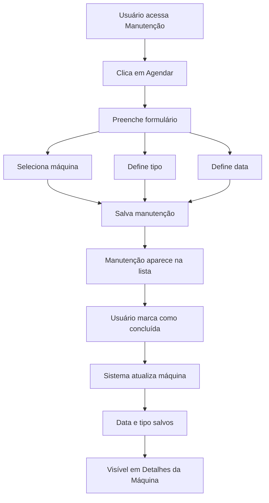
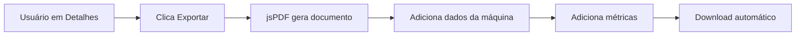

# Precisium Factory Control - Documentação Técnica


---

## 📋 Índice

1. [Visão Geral](#visão-geral)
2. [Arquitetura do Sistema](#arquitetura-do-sistema)
3. [Tecnologias Utilizadas](#tecnologias-utilizadas)
4. [Funcionalidades](#funcionalidades)
5. [Estrutura de Pastas](#estrutura-de-pastas)
6. [Instalação e Configuração](#instalação-e-configuração)
7. [Componentes Principais](#componentes-principais)
8. [Gerenciamento de Estado](#gerenciamento-de-estado)
9. [Fluxos de Trabalho](#fluxos-de-trabalho)
10. [API e Tipos](#api-e-tipos)
11. [Personalização](#personalização)
12. [Deploy](#deploy)

---

## 🎯 Visão Geral

O **Precisium Factory Control** é um sistema web moderno para gerenciamento e monitoramento de operações industriais. Desenvolvido com React e TypeScript, oferece uma interface intuitiva e responsiva para controle de máquinas CNC, ordens de produção, manutenções e relatórios.

### Características Principais

- ✅ **Interface Moderna**: Design premium com tema dark e animações suaves
- ✅ **Tempo Real**: Monitoramento de status de máquinas e produção
- ✅ **Gestão Completa**: Máquinas, ordens, manutenções, operadores e peças
- ✅ **Relatórios**: Exportação de relatórios em PDF
- ✅ **Responsivo**: Funciona perfeitamente em desktop, tablet e mobile
- ✅ **Sem Backend**: Sistema totalmente client-side (pode ser integrado com API)

---

## 🏗️ Arquitetura do Sistema

```
┌─────────────────────────────────────────────────────────┐
│                    CAMADA DE INTERFACE                   │
│  Dashboard │ Máquinas │ Manutenção │ Relatórios │ etc.  │
└─────────────────────────────────────────────────────────┘
                            ↓
┌─────────────────────────────────────────────────────────┐
│                   CAMADA DE APLICAÇÃO                    │
│   React Components │ Context API │ React Router          │
└─────────────────────────────────────────────────────────┘
                            ↓
┌─────────────────────────────────────────────────────────┐
│                     CAMADA DE DADOS                      │
│        Mock Data │ Local State │ (Future: API)          │
└─────────────────────────────────────────────────────────┘
```

### Fluxo de Dados

1. **Usuário interage** com a interface
2. **Componente dispara ação** via Context API
3. **Estado global é atualizado**
4. **Componentes re-renderizam** automaticamente
5. **Interface reflete mudanças** instantaneamente

---

## 🛠️ Tecnologias Utilizadas

### Core
- **React 19.2.0** - Biblioteca UI
- **TypeScript 5.6** - Tipagem estática
- **Vite 6.4** - Build tool e dev server

### UI/UX
- **Tailwind CSS 3.x** - Framework CSS utility-first
- **Google Fonts** - Inter & Space Grotesk
- **Material Symbols** - Ícones

### Bibliotecas
- **React Router DOM 7.9** - Roteamento SPA
- **Recharts 3.5** - Gráficos e visualizações
- **jsPDF 2.5** - Geração de PDFs

### Ferramentas
- **ESLint** - Linting
- **PostCSS** - Processamento CSS

---

## ⚙️ Funcionalidades

### 1. Dashboard
- Visão geral da produção em tempo real
- Gráficos de produção por hora
- Status das máquinas (operando, parada, manutenção)
- Alertas e notificações prioritárias
- Métricas de eficiência (OEE)

### 2. Gestão de Máquinas
- Listagem de todas as máquinas CNC
- Detalhes individuais com gráficos de vibração
- Monitoramento de temperatura e parâmetros
- Histórico de manutenções
- Exportação de relatórios em PDF

### 3. Ordens de Produção
- Criação e gerenciamento de ordens
- Acompanhamento de progresso
- Vinculação com máquinas e operadores
- Status: Pendente, Em Progresso, Concluída, Cancelada

### 4. Manutenção
- Agendamento de manutenções preventivas
- Registro de manutenções corretivas e preditivas
- Histórico completo por máquina
- Níveis de criticidade (Alta, Média, Baixa)
- Integração automática com detalhes da máquina

### 5. Catálogo de Peças
- Gestão de estoque de peças
- Informações de material e código
- Controle de quantidade disponível

### 6. Operadores
- Cadastro de operadores
- Vinculação com máquinas
- Métricas de eficiência

### 7. Ocorrências
- Registro de problemas e falhas
- Priorização (Alta, Média, Baixa)
- Acompanhamento de resolução

### 8. Usuários
- Gestão de usuários do sistema
- Perfis: Admin, Técnico, Operador
- Controle de acesso

### 9. Relatórios
- Exportação de dados em PDF
- Relatórios personalizados por período
- Análises de produtividade

### 10. Configurações
- Dados da fábrica
- Preferências do sistema
- Tema claro/escuro

---

## 📁 Estrutura de Pastas

```
precisium-factory-control/
├── public/                    # Arquivos estáticos
├── src/
│   ├── components/           # Componentes reutilizáveis
│   │   ├── Layout.tsx       # Layout principal com sidebar
│   │   ├── Modal.tsx        # Modal genérico
│   │   └── StatsCard.tsx    # Card de estatísticas
│   │
│   ├── pages/               # Páginas da aplicação
│   │   ├── Dashboard.tsx
│   │   ├── Machines.tsx
│   │   ├── MachineDetails.tsx
│   │   ├── Maintenance.tsx
│   │   ├── OrderList.tsx
│   │   ├── Parts.tsx
│   │   ├── Operators.tsx
│   │   ├── Occurrences.tsx
│   │   ├── Reports.tsx
│   │   ├── Users.tsx
│   │   ├── Settings.tsx
│   │   ├── Notifications.tsx
│   │   └── Login.tsx
│   │
│   ├── context/
│   │   └── AppContext.tsx   # Estado global da aplicação
│   │
│   ├── types.ts             # Definições TypeScript
│   ├── mockData.ts          # Dados de exemplo
│   ├── App.tsx              # Componente raiz
│   └── main.tsx             # Entry point
│
├── index.html               # HTML base
├── package.json             # Dependências
├── tsconfig.json            # Configuração TypeScript
├── vite.config.ts           # Configuração Vite
└── tailwind.config.js       # Configuração Tailwind
```

---

## 🚀 Instalação e Configuração

### Pré-requisitos
- Node.js 20.19+ ou 22.12+
- npm 10+

### Instalação

```bash
# 1. Clone ou extraia o projeto
cd precisium-factory-control

# 2. Instale as dependências
npm install

# 3. Inicie o servidor de desenvolvimento
npm run dev

# 4. Acesse no navegador
http://localhost:5173
```

### Build para Produção

```bash
# Gera build otimizado na pasta dist/
npm run build

# Preview do build
npm run preview
```

---

## 🧩 Componentes Principais

### Layout.tsx
Componente wrapper que fornece:
- Sidebar navegável
- Header com notificações
- Área de conteúdo principal
- Responsividade mobile

```typescript
<Layout onLogout={handleLogout}>
  <Outlet /> {/* Renderiza páginas */}
</Layout>
```

### StatsCard.tsx
Card reutilizável para métricas:
```typescript
<StatsCard 
  title="Produção do dia"
  value="1,280"
  trend="+5.2%"
  trendUp={true}
  icon="conveyor_belt"
/>
```

### Modal.tsx
Modal genérico para formulários:
```typescript
<Modal isOpen={isOpen} onClose={handleClose} title="Título">
  {/* Conteúdo */}
</Modal>
```

---

## 🔄 Gerenciamento de Estado

### AppContext

O sistema usa **React Context API** para gerenciamento de estado global.

#### Estrutura

```typescript
interface AppContextType {
  // Tema
  theme: 'dark' | 'light';
  toggleTheme: () => void;
  
  // Máquinas
  machines: Machine[];
  addMachine: (machine: Machine) => void;
  
  // Manutenções
  maintenanceList: Maintenance[];
  addMaintenance: (maintenance: Maintenance) => void;
  markMaintenanceCompleted: (id: string) => void;
  
  // ... outros recursos
}
```

#### Uso

```typescript
import { useApp } from '../context/AppContext';

function MyComponent() {
  const { machines, addMachine } = useApp();
  
  // Usar estado e funções
}
```

---

## 📊 Fluxos de Trabalho

### Fluxo de Manutenção



### Fluxo de Exportação PDF



---

## 📝 API e Tipos

### Tipos Principais

#### Machine
```typescript
interface Machine {
  id: string;                    // Ex: "CNC-001"
  name: string;                  // Ex: "Torno CNC-A01"
  model: string;                 // Ex: "Siemens Sinumerik 840D"
  status: 'Operando' | 'Parada' | 'Manutenção' | 'Ociosa';
  hours: number;                 // Horas trabalhadas
  lastMaintenance: string;       // Data: "DD/MM/YYYY"
  lastMaintenanceType?: string;  // Tipo da última manutenção
}
```

#### Maintenance
```typescript
interface Maintenance {
  id: string;                    // Ex: "#MP-0851"
  machine: string;               // Nome da máquina
  type: 'Preventiva' | 'Corretiva' | 'Preditiva';
  date: string;                  // "DD/MM/YYYY"
  technician: string;
  description: string;
  criticality: 'Alta' | 'Média' | 'Baixa';
  status: 'Pendente' | 'Agendada' | 'Concluída';
}
```

#### Order
```typescript
interface Order {
  id: string;
  part: string;
  quantity: number;
  operator: string;
  machine: string;
  progress: number;              // 0-100
  status: 'Concluída' | 'Em Progresso' | 'Pendente' | 'Cancelado';
}
```

---

## 🎨 Personalização

### Cores

Edite `tailwind.config.js`:

```javascript
theme: {
  extend: {
    colors: {
      primary: "#0a85ff",        // Azul principal
      "background-dark": "#0f1923",
      "surface-dark": "#111418",
      "border-dark": "#27303a"
    }
  }
}
```

### Dados Iniciais

Edite `src/mockData.ts` para alterar dados de exemplo.

### Logo e Branding

- Altere o título em `index.html`
- Modifique o nome em `components/Layout.tsx`
- Atualize favicon em `public/`

---

## 🌐 Deploy

### GitHub Pages

1. Build do projeto:
```bash
npm run build
```

2. Faça upload da pasta `dist/` para o repositório

3. Configure GitHub Pages para usar a branch com o conteúdo de `dist/`

### Netlify

1. Arraste a pasta `dist/` para https://app.netlify.com/drop

### Vercel

1. Conecte o repositório em https://vercel.com
2. Deploy automático

---

## 📞 Suporte e Contato

Para dúvidas técnicas ou suporte:
- **Email**: suporte@precisium.com
- **Documentação**: Este arquivo
- **Manual do Usuário**: Consulte `MANUAL_USUARIO.md`

---

## 📄 Licença

© 2024 Precisium Factory Control. Todos os direitos reservados.

---

**Versão**: 1.0.0  
**Última Atualização**: Dezembro 2024  
**Desenvolvido com**: ❤️ e React
