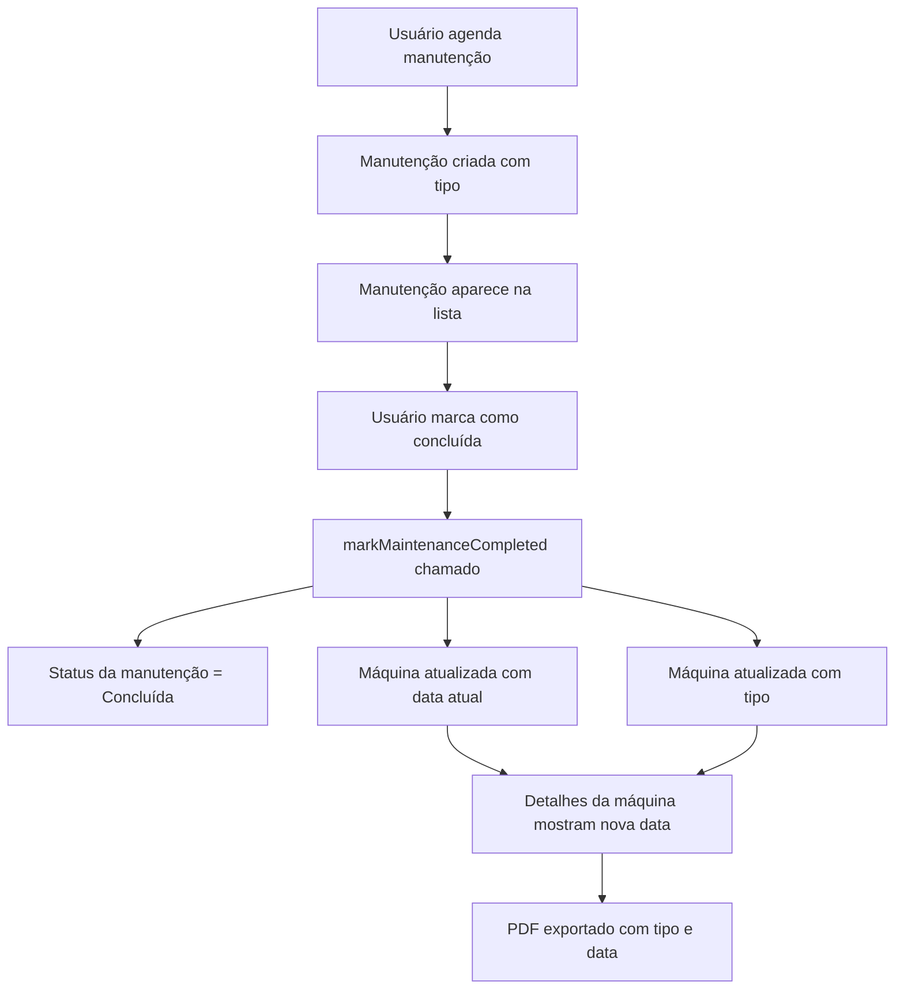

# Correção da Integração de Manutenção

## Resumo
Corrigidos dois problemas críticos no sistema de manutenção: campo de tipo em branco ao agendar e falta de integração entre manutenção e detalhes da máquina.

---

## Problemas Corrigidos

### 1. Campo "Tipo" em Branco ao Agendar Manutenção

**Problema**: Ao agendar uma manutenção preventiva, o campo "Tipo" aparecia em branco na tabela.

**Causa**: O estado inicial `newMaintenance` não incluía o campo `type` com valor padrão.

**Solução**: Adicionado `type: 'Preventiva'` ao estado inicial em [`Maintenance.tsx`](file:///c:/Users/Aluno_iot/Downloads/precisium-factory-control%20%282%29/pages/Maintenance.tsx)

```diff
const [newMaintenance, setNewMaintenance] = useState<Partial<MaintenanceType>>({
  status: 'Agendada',
  criticality: 'Média',
+ type: 'Preventiva',
  date: new Date().toISOString().split('T')[0] 
});
```

**Resultado**: O tipo de manutenção agora é exibido corretamente na tabela após o agendamento.

---

### 2. Integração Manutenção ↔ Máquina

**Problema**: Quando uma manutenção era finalizada, os detalhes da máquina não eram atualizados com a data e tipo da manutenção.

**Solução Implementada**:

#### A. Adicionado campo `lastMaintenanceType` ao tipo `Machine`

[`types.ts`](file:///c:/Users/Aluno_iot/Downloads/precisium-factory-control%20%282%29/types.ts):
```typescript
export interface Machine {
  id: string;
  name: string;
  model: string;
  status: 'Operando' | 'Parada' | 'Manutenção' | 'Ociosa';
  hours: number;
  lastMaintenance: string;
  lastMaintenanceType?: string; // ✨ Novo campo
}
```

#### B. Atualizado `markMaintenanceCompleted` no contexto

[`AppContext.tsx`](file:///c:/Users/Aluno_iot/Downloads/precisium-factory-control%20%282%29/context/AppContext.tsx):
```typescript
const markMaintenanceCompleted = (id: string) => {
  const maintenance = maintenanceList.find(m => m.id === id);
  if (maintenance) {
    // Atualiza status da manutenção
    setMaintenanceList(maintenanceList.map(m => 
      m.id === id ? { ...m, status: 'Concluída' } : m
    ));
    
    // Atualiza dados da máquina
    const today = new Date();
    const formattedDate = `${String(today.getDate()).padStart(2, '0')}/${String(today.getMonth() + 1).padStart(2, '0')}/${today.getFullYear()}`;
    
    setMachines(prevMachines => 
      prevMachines.map(machine => 
        machine.name === maintenance.machine 
          ? { 
              ...machine, 
              lastMaintenance: formattedDate, 
              lastMaintenanceType: maintenance.type 
            }
          : machine
      )
    );
  }
};
```

#### C. Atualizado PDF para incluir tipo de manutenção

[`MachineDetails.tsx`](file:///c:/Users/Aluno_iot/Downloads/precisium-factory-control%20%282%29/pages/MachineDetails.tsx):
```typescript
doc.text(
  `Última Manutenção: ${machine.lastMaintenance}${
    machine.lastMaintenanceType ? ` (${machine.lastMaintenanceType})` : ''
  }`, 
  15, 86
);
```

#### D. Atualizado UI de Detalhes da Máquina

Substituído o card "Manutenções Próximas" por "Histórico de Manutenção" que exibe:
- ✅ Última manutenção realizada (tipo + data)
- 📅 Status da próxima preventiva

```tsx
{machine.lastMaintenance && (
  <div className="flex items-start gap-3">
    <span className="material-symbols-outlined text-green-500">check_circle</span>
    <div>
      <p className="font-medium text-gray-900 dark:text-white">
        {machine.lastMaintenanceType || 'Manutenção'} Realizada
      </p>
      <p className="text-xs text-gray-500">{machine.lastMaintenance}</p>
    </div>
  </div>
)}
```

---

## Fluxo Completo de Integração



---

## Arquivos Modificados

| Arquivo | Alterações |
|---------|-----------|
| [`types.ts`](file:///c:/Users/Aluno_iot/Downloads/precisium-factory-control%20%282%29/types.ts) | Adicionado campo `lastMaintenanceType?` à interface `Machine` |
| [`AppContext.tsx`](file:///c:/Users/Aluno_iot/Downloads/precisium-factory-control%20%282%29/context/AppContext.tsx) | Atualizado `markMaintenanceCompleted` para sincronizar com máquinas |
| [`Maintenance.tsx`](file:///c:/Users/Aluno_iot/Downloads/precisium-factory-control%20%282%29/pages/Maintenance.tsx) | Corrigido estado inicial com `type: 'Preventiva'` |
| [`MachineDetails.tsx`](file:///c:/Users/Aluno_iot/Downloads/precisium-factory-control%20%282%29/pages/MachineDetails.tsx) | Atualizado PDF e UI para exibir tipo de manutenção |

---

## Teste do Fluxo

1. **Agendar Manutenção**:
   - Vá para Manutenção → Agendar
   - Selecione uma máquina (ex: "Torno CNC-A01")
   - Escolha tipo "Preventiva"
   - Preencha descrição e data
   - Clique em "Agendar"
   - ✅ Verifique que o tipo aparece na tabela

2. **Finalizar Manutenção**:
   - Clique no ✓ verde ao lado da manutenção agendada
   - Status muda para "Concluída"
   - ✅ Data atual é registrada

3. **Verificar Detalhes da Máquina**:
   - Vá para Máquinas → Clique na máquina
   - ✅ Verifique "Histórico de Manutenção" mostra tipo e data
   - Clique em "Exportar Relatório"
   - ✅ PDF mostra "Última Manutenção: DD/MM/AAAA (Preventiva)"

---

## Resultado Final

✅ Campo tipo sempre preenchido ao agendar  
✅ Máquinas atualizadas automaticamente ao concluir manutenção  
✅ Tipo de manutenção visível nos detalhes da máquina  
✅ PDF exportado com informações completas  
✅ Sincronização bidirecional entre manutenção e máquinas
